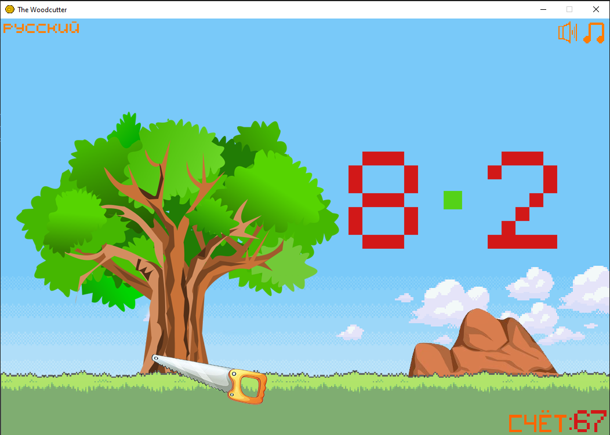

# The-Woodcutter
A game for multiplication table remembering
- The player's goal is to cut down as many trees as possible by solving multiplication tasks
- English and Russian language support
- Works on pygame
##

